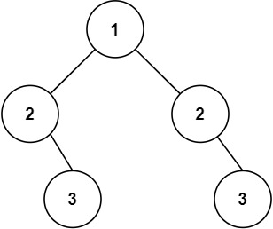

# 101. 对称二叉树

## 题目描述

101. 对称二叉树

给你一个二叉树的根节点 root ， 检查它是否轴对称。


示例 1：

>  **输入**
>
> root = [1,2,2,3,4,4,3]
>
>  **输出**
>
> true



示例 2：

>  **输入**
>
> root = [1,2,2,null,3,null,3]
>
>  **输出**
>
> false

提示：

- 树中节点数目在范围 `[1, 1000]` 内
- `-100 <= Node.val <= 100`

进阶：你可以运用递归和迭代两种方法解决这个问题吗？

## 思路分析

这道题很明显就是递归做的，然后我就是这么做的。LeetCode官方还给出了基于迭代的实现，使用队列来模拟递归过程：

```c++
class Solution {
public:
    bool check(TreeNode *u, TreeNode *v) {
        queue <TreeNode*> q;
        q.push(u); q.push(v);
        while (!q.empty()) {
            u = q.front(); q.pop();
            v = q.front(); q.pop();
            if (!u && !v) continue;
            if ((!u || !v) || (u->val != v->val)) return false;

            q.push(u->left); 
            q.push(v->right);

            q.push(u->right); 
            q.push(v->left);
        }
        return true;
    }

    bool isSymmetric(TreeNode* root) {
        return check(root, root);
    }
};
```

## 代码实现

代码实现如下：

```c++
class Solution {
public:
    bool isSubtreeEqual(TreeNode* a, TreeNode* b) {
        if (!a && !b) return true;
        if (!a || !b) return false;
        if (a->val != b->val) return false;
        return isSubtreeEqual(a->left, b->right) && isSubtreeEqual(a->right, b->left);
    }

    bool isSymmetric(TreeNode* root) {
        if (!root) return true;
        return isSubtreeEqual(root->left, root->right);
    }
};
```

## 复杂度分析

- 时间复杂度：$O(n)$
- 空间复杂度：$O(n)$

## 测试用例

测试用例如下：

```c++
#include <gtest/gtest.h>
#include "101-symmetric-tree.cpp"
#include <vector>

// 辅助函数：根据数组和下标递归构建完全二叉树（nullptr用-1表示）
TreeNode* createTree(const std::vector<int>& vals, int idx = 0) {
    if (idx >= vals.size() || vals[idx] == -1) return nullptr;
    TreeNode* root = new TreeNode(vals[idx]);
    root->left = createTree(vals, 2 * idx + 1);
    root->right = createTree(vals, 2 * idx + 2);
    return root;
}

// 辅助函数：释放二叉树内存
void freeTree(TreeNode* root) {
    if (!root) return;
    freeTree(root->left);
    freeTree(root->right);
    delete root;
}

TEST(SymmetricTreeTest, Example1) {
    Solution sol;
    // 输入: [1,2,2,3,4,4,3] 是对称的
    TreeNode* root = createTree({1,2,2,3,4,4,3});
    EXPECT_TRUE(sol.isSymmetric(root));
    freeTree(root);
}

TEST(SymmetricTreeTest, NotSymmetric) {
    Solution sol;
    // 输入: [1,2,2,-1,3,-1,3] 不是对称的
    TreeNode* root = createTree({1,2,2,-1,3,-1,3});
    EXPECT_FALSE(sol.isSymmetric(root));
    freeTree(root);
}

TEST(SymmetricTreeTest, SingleNode) {
    Solution sol;
    TreeNode* root = createTree({1});
    EXPECT_TRUE(sol.isSymmetric(root));
    freeTree(root);
}

TEST(SymmetricTreeTest, EmptyTree) {
    Solution sol;
    TreeNode* root = nullptr;
    EXPECT_TRUE(sol.isSymmetric(root));
}

TEST(SymmetricTreeTest, LeftSkewed) {
    Solution sol;
    // 手动构建左斜树 1->2->3
    TreeNode* root = new TreeNode(1);
    root->left = new TreeNode(2);
    root->left->left = new TreeNode(3);
    EXPECT_FALSE(sol.isSymmetric(root));
    freeTree(root);
}

int main(int argc, char **argv) {
    ::testing::InitGoogleTest(&argc, argv);
    return RUN_ALL_TESTS();
}
```

## 测试结果

测试结果如下所示：

```
[==========] Running 5 tests from 1 test suite.
[----------] Global test environment set-up.
[----------] 5 tests from SymmetricTreeTest
[ RUN      ] SymmetricTreeTest.Example1
[       OK ] SymmetricTreeTest.Example1 (0 ms)
[ RUN      ] SymmetricTreeTest.NotSymmetric
[       OK ] SymmetricTreeTest.NotSymmetric (0 ms)
[ RUN      ] SymmetricTreeTest.SingleNode
[       OK ] SymmetricTreeTest.SingleNode (0 ms)
[ RUN      ] SymmetricTreeTest.EmptyTree
[       OK ] SymmetricTreeTest.EmptyTree (0 ms)
[ RUN      ] SymmetricTreeTest.LeftSkewed
[       OK ] SymmetricTreeTest.LeftSkewed (0 ms)
[----------] 5 tests from SymmetricTreeTest (2 ms total)

[----------] Global test environment tear-down
[==========] 5 tests from 1 test suite ran. (4 ms total)
[  PASSED  ] 5 tests.
```