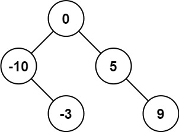

# 108. 将有序数组转换为二叉搜索树

## 题目描述

给你一个整数数组 nums ，其中元素已经按 升序 排列，请你将其转换为一棵 平衡 二叉搜索树。


示例 1：

>  **输入**
>
> nums = [-10,-3,0,5,9]
>
>  **输出**
>
> [0,-3,9,-10,null,5]
>
>  **解释**
>
> [0,-10,5,null,-3,null,9] 也将被视为正确答案：
>
> 


示例 2：

>  **输入**
>
> nums = [1,3]
>
>  **输出**
>
> [3,1]
>
>  **解释**
>
> [1,null,3] 和 [3,1] 都是高度平衡二叉搜索树。

提示：

- `1 <= nums.length <= 104`
- `-104 <= nums[i] <= 104`
- `nums` 按 **严格递增** 顺序排列


## 思路分析

这道题想到了需要使用中间的值作为根节点，但是后面的不断递归没有想到，也是囿于不会写平衡二叉树了。

LeetCode官方给出了3种方法，其实都大差不差的。

1. 中序遍历，总是选择中间位置左边的数字作为根节点

```c++
class Solution {
public:
    TreeNode* sortedArrayToBST(vector<int>& nums) {
        return helper(nums, 0, nums.size() - 1);
    }

    TreeNode* helper(vector<int>& nums, int left, int right) {
        if (left > right) {
            return nullptr;
        }

        // 总是选择中间位置左边的数字作为根节点
        int mid = (left + right) / 2;

        TreeNode* root = new TreeNode(nums[mid]);
        root->left = helper(nums, left, mid - 1);
        root->right = helper(nums, mid + 1, right);
        return root;
    }
};
```

2. 中序遍历，总是选择中间位置右边的数字作为根节点

```c++
class Solution {
public:
    TreeNode* sortedArrayToBST(vector<int>& nums) {
        return helper(nums, 0, nums.size() - 1);
    }

    TreeNode* helper(vector<int>& nums, int left, int right) {
        if (left > right) {
            return nullptr;
        }

        // 总是选择中间位置右边的数字作为根节点
        int mid = (left + right + 1) / 2;

        TreeNode* root = new TreeNode(nums[mid]);
        root->left = helper(nums, left, mid - 1);
        root->right = helper(nums, mid + 1, right);
        return root;
    }
};
```

3. 中序遍历，随机选择中间位置的数字作为根节点

## 代码实现


```c++
class Solution {
public:
    TreeNode* sortedArrayToBST(vector<int>& nums) {
        return helper(nums, 0, nums.size() - 1);
    }

    TreeNode* helper(vector<int>& nums, int left, int right) {
        if (left > right) {
            return nullptr;
        }

        // 选择任意一个中间位置数字作为根节点
        int mid = (left + right + rand() % 2) / 2;

        TreeNode* root = new TreeNode(nums[mid]);
        root->left = helper(nums, left, mid - 1);
        root->right = helper(nums, mid + 1, right);
        return root;
    }
};
```

## 复杂度分析

- 时间复杂度：$O(n)$，其中 $n$ 是数组的长度。每个数字只访问一次。

- 空间复杂度：$O(\log n)$，其中 $n$ 是数组的长度。空间复杂度不考虑返回值，因此空间复杂度主要取决于递归栈的深度，递归栈的深度是 $O(\log n)$。

## 测试用例

测试用例如下：

```c++
#include <gtest/gtest.h>
#include "108-convert-sorted-array-to-binary-search-tree.cpp"
#include <vector>

// 辅助函数：释放二叉树内存
void freeTree(TreeNode* root) {
    if (!root) return;
    freeTree(root->left);
    freeTree(root->right);
    delete root;
}

// 辅助函数：中序遍历二叉树，返回节点值
void inorder(TreeNode* root, std::vector<int>& res) {
    if (!root) return;
    inorder(root->left, res);
    res.push_back(root->val);
    inorder(root->right, res);
}

TEST(SortedArrayToBSTTest, Example1) {
    Solution sol;
    std::vector<int> nums = {-10,-3,0,5,9};
    TreeNode* root = sol.sortedArrayToBST(nums);
    std::vector<int> inorderRes;
    inorder(root, inorderRes);
    EXPECT_EQ(inorderRes, nums);
    freeTree(root);
}

TEST(SortedArrayToBSTTest, SingleNode) {
    Solution sol;
    std::vector<int> nums = {1};
    TreeNode* root = sol.sortedArrayToBST(nums);
    std::vector<int> inorderRes;
    inorder(root, inorderRes);
    EXPECT_EQ(inorderRes, nums);
    freeTree(root);
}

TEST(SortedArrayToBSTTest, EmptyArray) {
    Solution sol;
    std::vector<int> nums = {};
    TreeNode* root = sol.sortedArrayToBST(nums);
    EXPECT_EQ(root, nullptr);
}

TEST(SortedArrayToBSTTest, TwoNodes) {
    Solution sol;
    std::vector<int> nums = {1,2};
    TreeNode* root = sol.sortedArrayToBST(nums);
    std::vector<int> inorderRes;
    inorder(root, inorderRes);
    EXPECT_EQ(inorderRes, nums);
    freeTree(root);
}

int main(int argc, char **argv) {
    ::testing::InitGoogleTest(&argc, argv);
    return RUN_ALL_TESTS();
}
```

## 测试结果

测试结果如下所示：

```
[==========] Running 4 tests from 1 test suite.
[----------] Global test environment set-up.
[----------] 4 tests from SortedArrayToBSTTest
[ RUN      ] SortedArrayToBSTTest.Example1
[       OK ] SortedArrayToBSTTest.Example1 (0 ms)
[ RUN      ] SortedArrayToBSTTest.SingleNode
[       OK ] SortedArrayToBSTTest.SingleNode (0 ms)
[ RUN      ] SortedArrayToBSTTest.EmptyArray
[       OK ] SortedArrayToBSTTest.EmptyArray (0 ms)
[ RUN      ] SortedArrayToBSTTest.TwoNodes
[       OK ] SortedArrayToBSTTest.TwoNodes (0 ms)
[----------] 4 tests from SortedArrayToBSTTest (0 ms total)

[----------] Global test environment tear-down
[==========] 4 tests from 1 test suite ran. (0 ms total)
[  PASSED  ] 4 tests.
```