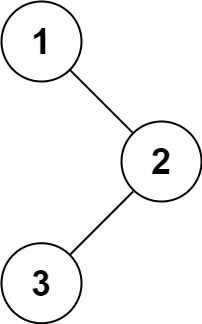

# 94. 二叉树的中序遍历

## 题目描述

94. 二叉树的中序遍历

给定一个二叉树的根节点 root ，返回 它的 **中序** 遍历 。



示例 1：

>  **输入**
>
> root = [1,null,2,3]
>
>  **输出**
>
> [1,3,2]

示例 2：

>  **输入**
>
> root = []
>
>  **输出**
>
> []

示例 3：

>  **输入**
>
> root = [1]
>
>  **输出**
>
> [1]

提示：

- 树中节点数目在范围 `[0, 100]` 内
- `-100 <= Node.val <= 100`

进阶: 递归算法很简单，你可以通过迭代算法完成吗？

## 思路分析

这道题连递归都忘了怎么写了...二叉树太久没用过全忘完了，不过其中的思想还是很好理解的：递归其实就是维护了一个隐藏的函数调用栈，而迭代就是显式维护了，能写出来递归就能写出来迭代的算法，根据调用顺序入栈出栈即可。

官方迭代法的代码示例如下：

```c++
class Solution {
public:
    vector<int> inorderTraversal(TreeNode* root) {
        vector<int> res;
        stack<TreeNode*> stk;
        while (root != nullptr || !stk.empty()) {
            while (root != nullptr) {
                stk.push(root);
                root = root->left;
            }
            root = stk.top();
            stk.pop();
            res.push_back(root->val);
            root = root->right;
        }
        return res;
    }
};
```

LeetCode官方还给出了一种基于迭代的优化算法：Morris 中序遍历。

Morris 遍历算法是另一种遍历二叉树的方法，它能将非递归的中序遍历空间复杂度降为 $O(1)$。

Morris 遍历算法整体步骤如下（假设当前遍历到的节点为 $x$）：

- 如果 $x$ 无左孩子，先将 $x$ 的值加入答案数组，再访问 $x$ 的右孩子，即 $x=x.right$。
- 如果 $x$ 有左孩子，则找到 $x$ 左子树上最右的节点（即左子树中序遍历的最后一个节点，$x$ 在中序遍历中的前驱节点），我们记为 $predecessor$。根据 $predecessor$ 的右孩子是否为空，进行如下操作：
    - 如果 $predecessor$ 的右孩子为空，则将其右孩子指向 $x$，然后访问 $x$ 的左孩子，即 $x=x.left$。
    - 如果 $predecessor$ 的右孩子不为空，则此时其右孩子指向 $x$，说明我们已经遍历完 $x$ 的左子树，我们将 $predecessor$ 的右孩子置空，将 $x$ 的值加入答案数组，然后访问 $x$ 的右孩子，即 $x=x.right$。

重复上述操作，直至访问完整棵树。

LeetCode官方代码示例如下：

```c++
class Solution {
public:
    vector<int> inorderTraversal(TreeNode* root) {
        vector<int> res;
        TreeNode *predecessor = nullptr;

        while (root != nullptr) {
            if (root->left != nullptr) {
                // predecessor 节点就是当前 root 节点向左走一步，然后一直向右走至无法走为止
                predecessor = root->left;
                while (predecessor->right != nullptr && predecessor->right != root) {
                    predecessor = predecessor->right;
                }
                
                // 让 predecessor 的右指针指向 root，继续遍历左子树
                if (predecessor->right == nullptr) {
                    predecessor->right = root;
                    root = root->left;
                }
                // 说明左子树已经访问完了，我们需要断开链接
                else {
                    res.push_back(root->val);
                    predecessor->right = nullptr;
                    root = root->right;
                }
            }
            // 如果没有左孩子，则直接访问右孩子
            else {
                res.push_back(root->val);
                root = root->right;
            }
        }
        return res;
    }
};
```

其实整个过程我们就多做一步：假设当前遍历到的节点为 $x$，将 $x$ 的左子树中最右边的节点的右孩子指向 $x$，这样在左子树遍历完成后我们通过这个指向走回了 $x$，且能通过这个指向知晓我们已经遍历完成了左子树，而不用再通过栈来维护，省去了栈的空间复杂度。

## 代码实现

代码实现如下：

```c++
#include <vector>

using namespace std;

class Solution {
public:
    void inorder(TreeNode* root, vector<int>& res) {
        if (!root) {
            return;
        }
        inorder(root->left, res);
        res.push_back(root->val);
        inorder(root->right, res);
    }
    vector<int> inorderTraversal(TreeNode* root) {
        vector<int> res;
        inorder(root, res);
        return res;
    }
};
```

## 复杂度分析

- 迭代/递归法

    - 时间复杂度：$O(n)$
    - 空间复杂度：$O(n)$

- Morris 中序遍历

    - 时间复杂度：$O(n)$
    - 空间复杂度：$O(1)$

## 测试用例

测试用例如下：

```c++
#include <gtest/gtest.h>
#include "94-binary-tree-inorder-traversal.cpp"
#include <vector>

// 辅助函数：根据数组和下标递归构建完全二叉树（nullptr用-1表示）
TreeNode* createTree(const std::vector<int>& vals, int idx = 0) {
    if (idx >= vals.size() || vals[idx] == -1) return nullptr;
    TreeNode* root = new TreeNode(vals[idx]);
    root->left = createTree(vals, 2 * idx + 1);
    root->right = createTree(vals, 2 * idx + 2);
    return root;
}

// 辅助函数：释放二叉树内存
void freeTree(TreeNode* root) {
    if (!root) return;
    freeTree(root->left);
    freeTree(root->right);
    delete root;
}

TEST(InorderTraversalTest, Example1) {
    Solution sol;
    // 输入: [1,null,2,3]，层序为[1,-1,2,-1,-1,3]
    TreeNode* root = createTree({1,-1,2,-1,-1,3});
    std::vector<int> expected = {1,3,2};
    EXPECT_EQ(sol.inorderTraversal(root), expected);
    freeTree(root);
}

TEST(InorderTraversalTest, SingleNode) {
    Solution sol;
    TreeNode* root = createTree({1});
    std::vector<int> expected = {1};
    EXPECT_EQ(sol.inorderTraversal(root), expected);
    freeTree(root);
}

TEST(InorderTraversalTest, EmptyTree) {
    Solution sol;
    TreeNode* root = nullptr;
    std::vector<int> expected = {};
    EXPECT_EQ(sol.inorderTraversal(root), expected);
}

TEST(InorderTraversalTest, CompleteTree) {
    Solution sol;
    // 完全二叉树 [1,2,3,4,5,6,7]
    TreeNode* root = createTree({1,2,3,4,5,6,7});
    std::vector<int> expected = {4,2,5,1,6,3,7};
    EXPECT_EQ(sol.inorderTraversal(root), expected);
    freeTree(root);
}

int main(int argc, char **argv) {
    ::testing::InitGoogleTest(&argc, argv);
    return RUN_ALL_TESTS();
}
```

## 测试结果

测试结果如下所示：

```
[==========] Running 4 tests from 1 test suite.
[----------] Global test environment set-up.
[----------] 4 tests from InorderTraversalTest
[ RUN      ] InorderTraversalTest.Example1
[       OK ] InorderTraversalTest.Example1 (0 ms)
[ RUN      ] InorderTraversalTest.SingleNode
[       OK ] InorderTraversalTest.SingleNode (0 ms)
[ RUN      ] InorderTraversalTest.EmptyTree
[       OK ] InorderTraversalTest.EmptyTree (0 ms)
[ RUN      ] InorderTraversalTest.CompleteTree
[       OK ] InorderTraversalTest.CompleteTree (0 ms)
[----------] 4 tests from InorderTraversalTest (0 ms total)

[----------] Global test environment tear-down
[==========] 4 tests from 1 test suite ran. (0 ms total)
[  PASSED  ] 4 tests.
```
