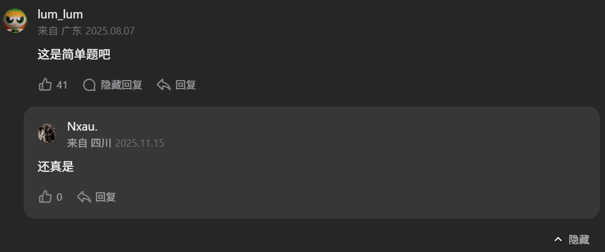

# 24. 两两交换链表中的节点

## 题目描述

24. 两两交换链表中的节点

给你一个链表，两两交换其中相邻的节点，并返回交换后链表的头节点。你必须在不修改节点内部的值的情况下完成本题（即，只能进行节点交换）。


示例 1：

>  **输入**
>
> head = [1,2,3,4]
>
>  **输出**
>
> [2,1,4,3]

示例 2：

>  **输入**
>
> head = []
>
>  **输出**
>
> []

示例 3：

>  **输入**
>
> head = [1]
>
>  **输出**
>
> [1]

提示：

- 链表中节点的数目在范围 `[0, 100]` 内
- `0 <= Node.val <= 100`

## 思路分析

**很酷😎不说话**



## 代码实现

代码实现如下：

```c++
class Solution {
public:
    ListNode* swapPairs(ListNode* head) {
        if(!head) return head;
        ListNode dummy_node(0,head);
        ListNode* pre_cur = &dummy_node;
        ListNode* cur_1 = head;
        while (cur_1 && cur_1->next) {
            ListNode* cur_2 = cur_1->next;
            pre_cur->next = cur_2;
            cur_1->next = cur_2->next;
            cur_2->next = cur_1;
            pre_cur = cur_1;
            cur_1 = cur_1->next;
        }
        return dummy_node.next;
    }
};
```

## 复杂度分析

- 时间复杂度：$O(n)$
- 空间复杂度：$O(1)$

## 测试用例

测试用例如下：

```c++
#include <gtest/gtest.h>
#include "24-swap-nodes-in-pairs.cpp"
#include <vector>

// 辅助函数：根据数组创建链表
ListNode* createList(const std::vector<int>& vals) {
    ListNode* dummy = new ListNode(0);
    ListNode* cur = dummy;
    for (int v : vals) {
        cur->next = new ListNode(v);
        cur = cur->next;
    }
    ListNode* head = dummy->next;
    delete dummy;
    return head;
}

// 辅助函数：链表转vector
std::vector<int> listToVector(ListNode* head) {
    std::vector<int> res;
    while (head) {
        res.push_back(head->val);
        head = head->next;
    }
    return res;
}

// 辅助函数：释放链表内存
void freeList(ListNode* head) {
    while (head) {
        ListNode* tmp = head;
        head = head->next;
        delete tmp;
    }
}

TEST(SwapPairsTest, Example1) {
    Solution sol;
    ListNode* head = createList({1,2,3,4});
    ListNode* res = sol.swapPairs(head);
    std::vector<int> expected = {2,1,4,3};
    EXPECT_EQ(listToVector(res), expected);
    freeList(res);
}

TEST(SwapPairsTest, OddNodes) {
    Solution sol;
    ListNode* head = createList({1,2,3});
    ListNode* res = sol.swapPairs(head);
    std::vector<int> expected = {2,1,3};
    EXPECT_EQ(listToVector(res), expected);
    freeList(res);
}

TEST(SwapPairsTest, SingleNode) {
    Solution sol;
    ListNode* head = createList({1});
    ListNode* res = sol.swapPairs(head);
    std::vector<int> expected = {1};
    EXPECT_EQ(listToVector(res), expected);
    freeList(res);
}

TEST(SwapPairsTest, EmptyList) {
    Solution sol;
    ListNode* head = nullptr;
    ListNode* res = sol.swapPairs(head);
    EXPECT_EQ(res, nullptr);
}

int main(int argc, char **argv) {
    ::testing::InitGoogleTest(&argc, argv);
    return RUN_ALL_TESTS();
}
```

## 测试结果

测试结果如下所示：

```
[==========] Running 4 tests from 1 test suite.
[----------] Global test environment set-up.   
[----------] 4 tests from SwapPairsTest        
[ RUN      ] SwapPairsTest.Example1
[       OK ] SwapPairsTest.Example1 (0 ms)     
[ RUN      ] SwapPairsTest.OddNodes
[       OK ] SwapPairsTest.OddNodes (0 ms)
[ RUN      ] SwapPairsTest.SingleNode
[       OK ] SwapPairsTest.SingleNode (0 ms)
[ RUN      ] SwapPairsTest.EmptyList
[       OK ] SwapPairsTest.EmptyList (0 ms)
[----------] 4 tests from SwapPairsTest (3 ms total)

[----------] Global test environment tear-down
[==========] 4 tests from 1 test suite ran. (4 ms total)
[  PASSED  ] 4 tests.
```
