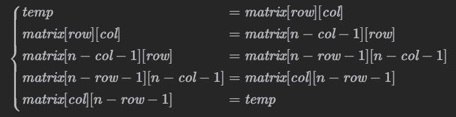

# 48. 旋转图像

## 题目描述

48. 旋转图像

给定一个 $n × n$ 的二维矩阵 `matrix` 表示一个图像。请你将图像顺时针旋转 $90$ 度。

你必须在 **原地** 旋转图像，这意味着你需要直接修改输入的二维矩阵。**请不要** 使用另一个矩阵来旋转图像。


示例 1：

>  **输入**
>
> matrix = [[1,2,3],[4,5,6],[7,8,9]]
>
>  **输出**
>
> [[7,4,1],[8,5,2],[9,6,3]]


示例 2：

>  **输入**
>
> matrix = [[5,1,9,11],[2,4,8,10],[13,3,6,7],[15,14,12,16]]
>
>  **输出**
>
> [[15,13,2,5],[14,3,4,1],[12,6,8,9],[16,7,10,11]]

提示：

- `n == matrix.length == matrix[i].length`
- `1 <= n <= 20`
- `-1000 <= matrix[i][j] <= 1000`

## 思路分析

这道题是旋转矩阵，其实仔细思考一下，其实就是四个矩阵元素的**循环移位**，然后这个过程不断重复，且只需要一个临时变量来存储被覆盖的那个矩阵元素即可。



## 代码实现

代码实现如下：

```c++
#include <vector>

using namespace std;

class Solution {
public:
    void rotate(vector<vector<int>>& matrix) {
        int n = matrix.size();
        for (int layer = 0; layer < n / 2; ++layer) {
            int first = layer;
            int last = n - 1 - layer;
            for (int i = first; i < last; ++i) {
                int offset = i - first;
                int top = matrix[first][i];
                matrix[first][i] = matrix[last - offset][first];
                matrix[last - offset][first] = matrix[last][last - offset];
                matrix[last][last - offset] = matrix[i][last];
                matrix[i][last] = top;
            }
        }
    }
};
```

## 复杂度分析

- 时间复杂度：$O(N^2)$

- 空间复杂度：$O(1)$

## 测试用例

测试用例如下：

```c++
#include <gtest/gtest.h>
#include "48-rotate-image.cpp"
#include <vector>

static Solution solution;

void assertMatrixEq(const std::vector<std::vector<int>>& a, const std::vector<std::vector<int>>& b) {
    ASSERT_EQ(a.size(), b.size());
    for (size_t i = 0; i < a.size(); ++i) {
        ASSERT_EQ(a[i], b[i]);
    }
}

TEST(RotateImageTest, Example1) {
    std::vector<std::vector<int>> matrix = {{1,2,3},{4,5,6},{7,8,9}};
    std::vector<std::vector<int>> expected = {{7,4,1},{8,5,2},{9,6,3}};
    solution.rotate(matrix);
    assertMatrixEq(matrix, expected);
}

TEST(RotateImageTest, Example2) {
    std::vector<std::vector<int>> matrix = {{1,2},{3,4}};
    std::vector<std::vector<int>> expected = {{3,1},{4,2}};
    solution.rotate(matrix);
    assertMatrixEq(matrix, expected);
}

TEST(RotateImageTest, SingleRowCol) {
    std::vector<std::vector<int>> matrix = {{1}};
    std::vector<std::vector<int>> expected = {{1}};
    solution.rotate(matrix);
    assertMatrixEq(matrix, expected);
}

TEST(RotateImageTest, FourByFour) {
    std::vector<std::vector<int>> matrix = {{1,2,3,4},{5,6,7,8},{9,10,11,12},{13,14,15,16}};
    std::vector<std::vector<int>> expected = {{13,9,5,1},{14,10,6,2},{15,11,7,3},{16,12,8,4}};
    solution.rotate(matrix);
    assertMatrixEq(matrix, expected);
}

int main(int argc, char **argv) {
    ::testing::InitGoogleTest(&argc, argv);
    return RUN_ALL_TESTS();
}
```

## 测试结果

测试结果如下所示：

```
[==========] Running 4 tests from 1 test suite.
[----------] Global test environment set-up.
[----------] 4 tests from RotateImageTest
[ RUN      ] RotateImageTest.Example1
[       OK ] RotateImageTest.Example1 (0 ms)
[ RUN      ] RotateImageTest.Example2
[       OK ] RotateImageTest.Example2 (0 ms)
[ RUN      ] RotateImageTest.SingleRowCol
[       OK ] RotateImageTest.SingleRowCol (0 ms)
[ RUN      ] RotateImageTest.FourByFour
[       OK ] RotateImageTest.FourByFour (0 ms)
[----------] 4 tests from RotateImageTest (1 ms total)

[----------] Global test environment tear-down
[==========] 4 tests from 1 test suite ran. (3 ms total)
[  PASSED  ] 4 tests.
```