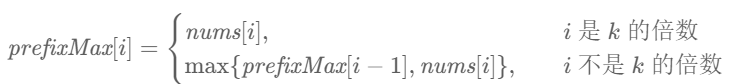
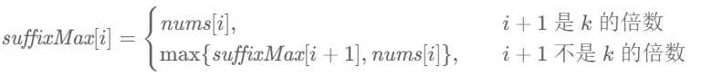

# 239. Sliding Window Maximum

## 题目描述

239. 滑动窗口最大值

给你一个整数数组 `nums`，有一个大小为 `k` 的滑动窗口从数组的最左侧移动到数组的最右侧。你只可以看到在滑动窗口内的 `k` 个数字。滑动窗口每次只向右移动一位。

返回 **滑动窗口中的最大值** 。

示例 1：

>  **输入**
>
> nums = [1,3,-1,-3,5,3,6,7], k = 3
>
>  **输出**
>
> [3,3,5,5,6,7]
>
>  **解释**
>
> 滑动窗口的位置        $\quad$        最大值
>
> \---------------     $\quad \quad$  -----
>
> [1  3  -1] -3  5  3  6  7       3
>
> 1 [3  -1  -3] 5  3  6  7       3
>
> 1  3 [-1  -3  5] 3  6  7       5
>
> 1  3  -1 [-3  5  3] 6  7       5
>
> 1  3  -1  -3 [5  3  6] 7       6
>
> 1  3  -1  -3  5 [3  6  7]      7

示例 2：

>  **输入**
>
> nums = [1], k = 1
>
>  **输出**
>
> [1]

提示：

- `1 <= nums.length <= 105`
- `-104 <= nums[i] <= 104`
- `1 <= k <= nums.length`

## 思路分析

这道题我尝试着逐个求每个滑动窗口的最大值，不出意料的Time Limit Exceeded了。然后看了下答案，果然是我没学过的高级东西，遂记录之。

官方使用了三种方法：

**优先队列法**

对于「最大值」，我们可以想到一种非常合适的数据结构，那就是优先队列（堆），其中的大根堆可以帮助我们实时维护一系列元素中的最大值。

对于本题而言，初始时，我们将数组 `nums` 的前 `k`个元素放入优先队列中。每当我们向右移动窗口时，我们就可以把一个新的元素放入优先队列中，此时堆顶的元素就是堆中所有元素的最大值。然而这个最大值可能并不在滑动窗口中，在这种情况下，这个值在数组 `nums` 中的位置出现在滑动窗口左边界的左侧。因此，当我们后续继续向右移动窗口时，这个值就永远不可能出现在滑动窗口中了，我们可以将其永久地从优先队列中移除。

我们不断地移除堆顶的元素，直到其确实出现在滑动窗口中。此时，堆顶元素就是滑动窗口中的最大值。为了方便判断堆顶元素与滑动窗口的位置关系，我们可以在优先队列中存储二元组 `(num,index)`，表示元素 `num` 在数组中的下标为 `index`。

官方代码示例如下：

```c++
class Solution {
public:
    vector<int> maxSlidingWindow(vector<int>& nums, int k) {
        int n = nums.size();
        priority_queue<pair<int, int>> q;
        for (int i = 0; i < k; ++i) {
            q.emplace(nums[i], i);
        }
        vector<int> ans = {q.top().first};
        for (int i = k; i < n; ++i) {
            q.emplace(nums[i], i);
            while (q.top().second <= i - k) {
                q.pop();
            }
            ans.push_back(q.top().first);
        }
        return ans;
    }
};
```

**单调队列法**

由于我们需要求出的是滑动窗口的最大值，如果当前的滑动窗口中有两个下标 `i` 和 `j`，其中 `i` 在 `j` 的左侧（$i<j$），并且 `i` 对应的元素不大于 `j` 对应的元素（$nums[i]≤nums[j]$），那么会发生什么呢？

当滑动窗口向右移动时，只要 `i` 还在窗口中，那么 `j` 一定也还在窗口中，这是 `i` 在 `j` 的左侧所保证的。因此，由于 `nums[j]` 的存在，`nums[i]` 一定不会是滑动窗口中的最大值了，我们可以将 `nums[i]` 永久地移除。

因此我们可以使用一个队列存储所有还没有被移除的下标。在队列中，这些下标按照从小到大的顺序被存储，并且它们在数组 `nums` 中对应的值是严格单调递减的。因为如果队列中有两个相邻的下标，它们对应的值相等或者递增，那么令前者为 `i`，后者为 `j`，就对应了上面所说的情况，即 `nums[i]` 会被移除，这就产生了矛盾。

当滑动窗口向右移动时，我们需要把一个新的元素放入队列中。为了保持队列的性质，我们会不断地将新的元素与队尾的元素相比较，如果前者大于等于后者，那么队尾的元素就可以被永久地移除，我们将其弹出队列。我们需要不断地进行此项操作，直到队列为空或者新的元素小于队尾的元素。

由于队列中下标对应的元素是严格单调递减的，因此此时队首下标对应的元素就是滑动窗口中的最大值。但与方法一中相同的是，此时的最大值可能在滑动窗口左边界的左侧，并且随着窗口向右移动，它永远不可能出现在滑动窗口中了。因此我们还需要不断从队首弹出元素，直到队首元素在窗口中为止。

为了可以同时弹出队首和队尾的元素，我们需要使用双端队列。满足这种单调性的双端队列一般称作「单调队列」。

官方代码示例如下：

```c++
class Solution {
public:
    vector<int> maxSlidingWindow(vector<int>& nums, int k) {
        int n = nums.size();
        deque<int> q;
        for (int i = 0; i < k; ++i) {
            while (!q.empty() && nums[i] >= nums[q.back()]) {
                q.pop_back();
            }
            q.push_back(i);
        }

        vector<int> ans = {nums[q.front()]};
        for (int i = k; i < n; ++i) {
            while (!q.empty() && nums[i] >= nums[q.back()]) {
                q.pop_back();
            }
            q.push_back(i);
            while (q.front() <= i - k) {
                q.pop_front();
            }
            ans.push_back(nums[q.front()]);
        }
        return ans;
    }
};
```

**分块预处理法**

除了基于「随着窗口的移动实时维护最大值」的方法一以及方法二之外，我们还可以考虑其他有趣的做法。

我们可以将数组 `nums` 从左到右按照 `k` 个一组进行分组，最后一组中元素的数量可能会不足 `k` 个。如果我们希望求出 `nums[i]` 到 `nums[i+k−1]` 的最大值，就会有两种情况：

如果 `i` 是 `k` 的倍数，那么 `nums[i]` 到 `nums[i+k−1]` 恰好是一个分组。我们只要预处理出每个分组中的最大值，即可得到答案；

如果 `i` 不是 `k` 的倍数，那么 `nums[i]` 到 `nums[i+k−1]` 会跨越两个分组，占有第一个分组的后缀以及第二个分组的前缀。假设 `j` 是 `k` 的倍数，并且满足 $i<j≤i+k−1$，那么 `nums[i]` 到 `nums[j−1]` 就是第一个分组的后缀，`nums[j]` 到 `nums[i+k−1]` 就是第二个分组的前缀。如果我们能够预处理出每个分组中的前缀最大值以及后缀最大值，同样可以在 $O(1)$ 的时间得到答案。

因此我们用 `prefixMax[i]` 表示下标 `i` 对应的分组中，以 `i` 结尾的前缀最大值；`suffixMax[i]` 表示下标 `i` 对应的分组中，以 `i` 开始的后缀最大值。它们分别满足如下的递推式



以及




需要注意在递推 `suffixMax[i]` 时需要考虑到边界条件 `suffixMax[n−1]=nums[n−1]`，而在递推 `prefixMax[i]` 时的边界条件 `prefixMax[0]=nums[0]` 恰好包含在递推式的第一种情况中，因此无需特殊考虑。

在预处理完成之后，对于 `nums[i]` 到 `nums[i+k−1]` 的所有元素，如果 `i` 不是 `k` 的倍数，那么窗口中的最大值为 `suffixMax[i]` 与 `prefixMax[i+k−1]` 中的较大值；如果 `i` 是 `k` 的倍数，那么此时窗口恰好对应一整个分组，`suffixMax[i]` 和 `prefixMax[i+k−1]` 都等于分组中的最大值，因此无论窗口属于哪一种情况，

`max{suffixMax[i],prefixMax[i+k−1]}`即为答案。

代码示例见代码实现部分。

## 代码实现

代码实现如下：

```c++
class Solution {
public:
    vector<int> maxSlidingWindow(vector<int>& nums, int k) {
        int n = nums.size();
        vector<int> prefixMax(n), suffixMax(n);
        for (int i = 0; i < n; ++i) {
            if (i % k == 0) {
                prefixMax[i] = nums[i];
            }
            else {
                prefixMax[i] = max(prefixMax[i - 1], nums[i]);
            }
        }
        for (int i = n - 1; i >= 0; --i) {
            if (i == n - 1 || (i + 1) % k == 0) {
                suffixMax[i] = nums[i];
            }
            else {
                suffixMax[i] = max(suffixMax[i + 1], nums[i]);
            }
        }

        vector<int> ans;
        for (int i = 0; i <= n - k; ++i) {
            ans.push_back(max(suffixMax[i], prefixMax[i + k - 1]));
        }
        return ans;
    }
};
```

## 复杂度分析

**方法一：优先队列**

- **时间复杂度：** $O(n \log k)$
  - 我们遍历数组需要 $O(n)$ 的时间。
  - 循环中的主要操作是向优先队列中添加元素 (`emplace`) 和移除元素 (`pop`)。由于优先队列的大小最多为 `k`，这些操作的时间复杂度都是 $O(\log k)$。
  - 因此，总的时间复杂度为 $O(n \log k)$。
- **空间复杂度：** $O(k)$
  - 优先队列中最多存储 `k` 个元素（窗口大小）。

**方法二：单调队列**

- **时间复杂度：** $O(n)$
  - 我们只遍历数组一次。
  - 对于每个元素，它最多被 `push_back` 一次和 `pop_back` 或 `pop_front` 一次。双端队列的这些操作的均摊时间复杂度为 $O(1)$。
  - 因此，总的时间复杂度为 $O(n)$。
- **空间复杂度：** $O(k)$
  - 在最坏的情况下（例如，数组是严格递减的），双端队列会存储 `k` 个元素的索引。

**方法三：分块预处理**

- **时间复杂度：** $O(n)$
  - 我们需要遍历数组三次：第一次计算 `prefixMax`，第二次计算 `suffixMax`，第三次遍历窗口并生成答案。每次遍历都是 $O(n)$。
  - 因此，总的时间复杂度为 $O(n)$。
- **空间复杂度：** $O(n)$
  - 我们需要额外的 `prefixMax` 和 `suffixMax` 数组来存储预处理结果，这两个数组的大小都是 `n`。


## 测试用例

测试用例如下：

```c++
#include <gtest/gtest.h>
#include "239-sliding-window-maximum.cpp"

static Solution solution;

TEST(MaxSlidingWindowTest, Example1) {
    std::vector<int> nums = {1, 3, -1, -3, 5, 3, 6, 7};
    int k = 3;
    std::vector<int> expected = {3, 3, 5, 5, 6, 7};
    EXPECT_EQ(solution.maxSlidingWindow(nums, k), expected);
}

TEST(MaxSlidingWindowTest, Example2) {
    std::vector<int> nums = {1};
    int k = 1;
    std::vector<int> expected = {1};
    EXPECT_EQ(solution.maxSlidingWindow(nums, k), expected);
}

TEST(MaxSlidingWindowTest, AllSame) {
    std::vector<int> nums = {4, 4, 4, 4, 4, 4};
    int k = 4;
    std::vector<int> expected = {4, 4, 4};
    EXPECT_EQ(solution.maxSlidingWindow(nums, k), expected);
}

TEST(MaxSlidingWindowTest, NegativeNumbers) {
    std::vector<int> nums = {-7, -8, -9, -1, -2, -3};
    int k = 2;
    std::vector<int> expected = {-7, -8, -1, -1, -2};
    EXPECT_EQ(solution.maxSlidingWindow(nums, k), expected);
}

TEST(MaxSlidingWindowTest, Empty) {
    std::vector<int> nums = {};
    int k = 1;
    std::vector<int> expected = {};
    EXPECT_EQ(solution.maxSlidingWindow(nums, k), expected);
}

int main(int argc, char **argv) {
    ::testing::InitGoogleTest(&argc, argv);
    return RUN_ALL_TESTS();
}
```

## 测试结果

测试结果如下所示：

```
[==========] Running 5 tests from 1 test suite.
[----------] Global test environment set-up.
[----------] 5 tests from MaxSlidingWindowTest
[ RUN      ] MaxSlidingWindowTest.Example1
[       OK ] MaxSlidingWindowTest.Example1 (0 ms)
[ RUN      ] MaxSlidingWindowTest.Example2
[       OK ] MaxSlidingWindowTest.Example2 (0 ms)
[ RUN      ] MaxSlidingWindowTest.AllSame
[       OK ] MaxSlidingWindowTest.AllSame (0 ms)
[ RUN      ] MaxSlidingWindowTest.NegativeNumbers
[       OK ] MaxSlidingWindowTest.NegativeNumbers (0 ms)
[ RUN      ] MaxSlidingWindowTest.Empty
[       OK ] MaxSlidingWindowTest.Empty (0 ms)
[----------] 5 tests from MaxSlidingWindowTest (2 ms total)

[----------] Global test environment tear-down
[==========] 5 tests from 1 test suite ran. (3 ms total)
[  PASSED  ] 5 tests.
```
