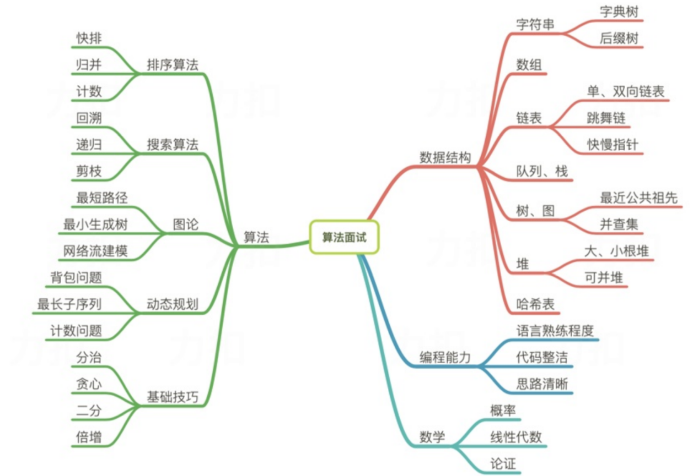

# LeetCode刷题自查导图



---

## 一、 数据结构 (Data Structures)
### 1. 字符串 (String)
- [ ] 字典树 (Trie)
  - [x] 208. 实现 Trie (前缀树) - Medium（需复习）
  - [x] 211. 添加与搜索单词 - Medium（需复习）
  - [x] 212. 单词搜索 II - Hard（需复习）
- [ ] 后缀树 (Suffix Tree/Array)
  - [ ] 1062. 最长重复子串 - Medium
  - [ ] 1044. 最长重复子串 - Hard
  - [ ] 214. 最短回文串 - Hard

### 2. 数组与双指针 (Array & Pointers)
- [x] 数组基础
  - [x] 1. 两数之和 - Easy（复习更优解）
  - [x] 189. 轮转数组 - Medium（复习更优解）
- [ ] 双指针 (Two Pointers)
  - [x] 11. 盛最多水的容器 - Medium
  - [ ] 15. 三数之和 - Medium
  - [ ] 167. 两数之和 II - 输入有序数组 - Medium
- [ ] 滑动窗口 (Sliding Window)
  - [ ] 3. 无重复字符的最长子串 - Medium
  - [ ] 209. 长度最小的子数组 - Medium
  - [ ] 76. 最小覆盖子串 - Hard

### 3. 链表 (Linked List)
- [ ] 单、双向链表基础
  - [ ] 206. 反转链表 - Easy
  - [ ] 2. 两数相加 - Medium
  - [ ] 146. LRU 缓存 (综合应用) - Medium
  - [ ] 25. K 个一组翻转链表 - Hard
- [ ] 快慢指针 (Fast & Slow Pointers)
  - [ ] 141. 环形链表 - Easy
  - [ ] 142. 环形链表 II - Medium
  - [ ] 287. 寻找重复数 - Medium
- [ ] 跳舞链 (Dancing Links)
  - [ ] 37. 解数独 - Hard

### 4. 栈与队列 (Stack & Queue)
- [ ] 基础应用
  - [ ] 20. 有效的括号 - Easy
  - [ ] 232. 用栈实现队列 - Easy
- [ ] 单调栈 (Monotonic Stack)
  - [ ] 496. 下一个更大元素 I - Easy
  - [ ] 503. 下一个更大元素 II - Medium
  - [ ] 739. 每日温度 - Medium
  - [ ] 42. 接雨水 - Hard
- [ ] 单调队列 (Monotonic Queue)
  - [ ] 239. 滑动窗口最大值 - Hard

### 5. 树、图与搜索 (Tree, Graph & Search)
- [ ] 最近公共祖先 (LCA)
  - [ ] 235. 二叉搜索树的最近公共祖先 - Medium
  - [ ] 236. 二叉树的最近公共祖先 - Medium
- [ ] 并查集 (Union Find)
  - [ ] 547. 省份数量 - Medium
  - [ ] 200. 岛屿数量 - Medium
- [ ] 拓扑排序 (Topological Sort)
  - [ ] 207. 课程表 - Medium
  - [ ] 210. 课程表 II - Medium
- [ ] 树状数组/线段树 (BIT/Segment Tree)
  - [ ] 307. 区域和检索 - 可变 - Medium

### 6. 堆 (Heap)
- [ ] 基础堆操作
  - [ ] 215. 数组中的第K个最大元素 - Medium
  - [ ] 347. 前 K 个高频元素 - Medium
- [ ] 可并堆/双堆法
  - [ ] 295. 数据流的中位数 - Hard
  - [ ] 480. 滑动窗口中位数 - Hard

### 7. 哈希表 (Hash Table)
- [ ] 哈希表应用
  - [ ] 49. 字母异位词分组 - Medium
  - [ ] 128. 最长连续序列 - Medium

---

## 二、 算法 (Algorithms)
### 1. 排序算法 (Sorting) - **大幅扩充**
- [ ] 基础排序 (理解原理)
  - [ ] 冒泡/选择/插入排序的概念实现
  - [ ] 147. 对链表进行插入排序 - Medium
- [ ] 快速排序 (Quick Sort)
  - [ ] 912. 排序数组 (用快排实现) - Medium
  - [ ] 75. 颜色分类 (三路快排思想) - Medium
- [ ] 归并排序 (Merge Sort)
  - [ ] 148. 排序链表 - Medium
  - [ ] 315. 计算右侧小于当前元素的个数 (归并变形) - Hard
- [ ] 堆排序 (Heap Sort)
  - [ ] 912. 排序数组 (用堆排实现) - Medium
- [ ] 桶排序/计数排序/基数排序 (Non-Comparison Sort)
  - [ ] 1122. 数组的相对排序 - Easy
  - [ ] 164. 最大间距 - Hard
  - [ ] 451. 根据字符出现频率排序 - Medium

### 2. 搜索算法 (Search)
- [ ] 回溯 (Backtracking)
  - [ ] 46. 全排列 - Medium
  - [ ] 78. 子集 - Medium
- [ ] 递归与深度优先 (DFS)
  - [ ] 133. 克隆图 - Medium
  - [ ] 130. 被围绕的区域 - Medium
- [ ] 广度优先 (BFS)
  - [ ] 102. 二叉树的层序遍历 - Medium
  - [ ] 127. 单词接龙 - Hard
- [ ] 剪枝 (Pruning)
  - [ ] 473. 火柴拼正方形 - Medium

### 3. 图论深度技巧 (Graph Theory)
- [ ] 最短路径 (Dijkstra/Floyd)
  - [ ] 743. 网络延迟时间 - Medium
- [ ] 最小生成树 (Prim/Kruskal)
  - [ ] 1584. 连接所有点的最小费用 - Medium
- [ ] 网络流建模
  - [ ] 1349. 参加考试的最多人数 - Hard

### 4. 动态规划 (DP)
- [ ] 背包问题 (Knapsack)
  - [ ] 416. 分割等和子集 - Medium
  - [ ] 322. 零钱兑换 - Medium
- [ ] 序列 DP
  - [ ] 300. 最长递增子序列 - Medium
  - [ ] 1143. 最长公共子序列 - Medium
- [ ] 状态压缩 DP
  - [ ] 698. 划分为k个相等的子集 - Medium

### 5. 基础技巧与数学 (Basic Tech & Math)
- [ ] 二分查找 (Binary Search)
  - [ ] 704. 二分查找 - Easy
  - [ ] 34. 在排序数组中查找元素的第一个和最后一个位置 - Medium
  - [ ] 4. 寻找两个正序数组的中位数 - Hard
- [ ] 位运算 (Bit Manipulation)
  - [ ] 136. 只出现一次的数字 - Easy
  - [ ] 191. 位1的个数 - Easy
  - [ ] 201. 数字范围按位与 - Medium
- [ ] 贪心 (Greedy)
  - [ ] 55. 跳跃游戏 - Medium
  - [ ] 135. 分发糖果 - Hard
- [ ] 倍增 (Binary Lifting)
  - [ ] 1483. 树节点的第 K 个祖先 - Hard

---

> 跑通测试代码需要预先安装GTest库
> ```bash
> sudo apt update
> sudo apt install -y libgtest-dev cmake
> ```

**💡 刷题建议：**
1. **先横后纵**：先掌握“基础技巧”和“常用数据结构”，再攻克“动态规划”和“图论”。
2. **注重总结**：每刷完一类题目，尝试总结该类题目的通用模板。
3. **软实力同步**：在刷题时，有意识地练习“思路清晰”地书写代码，模拟面试表达。